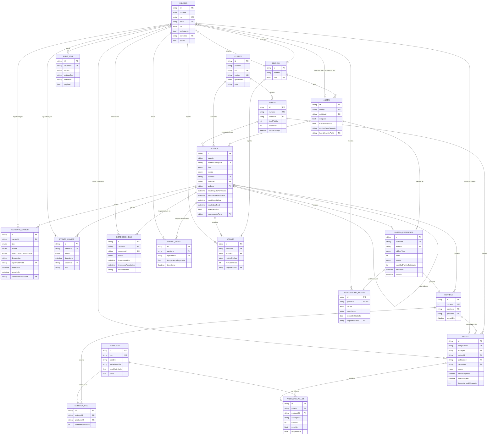
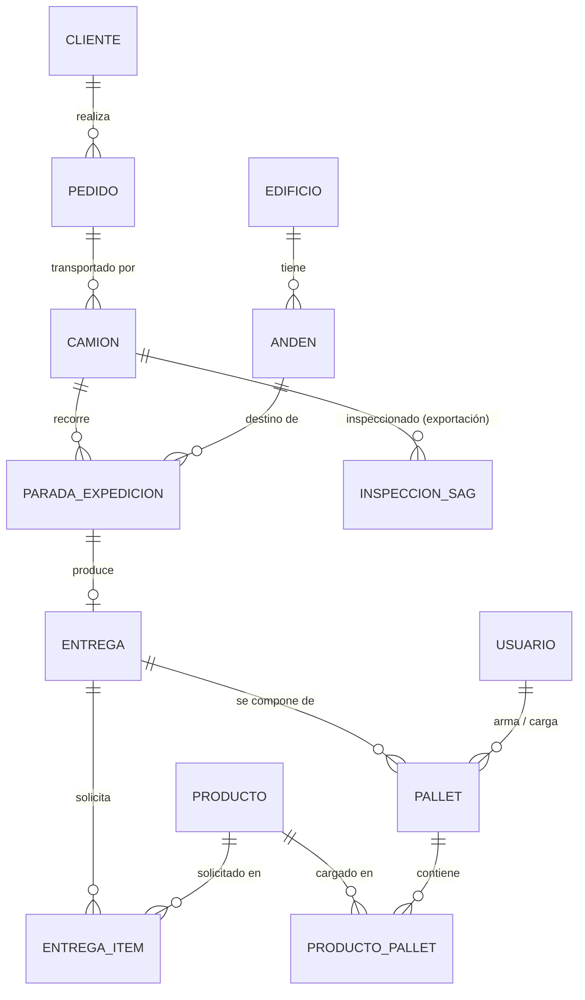
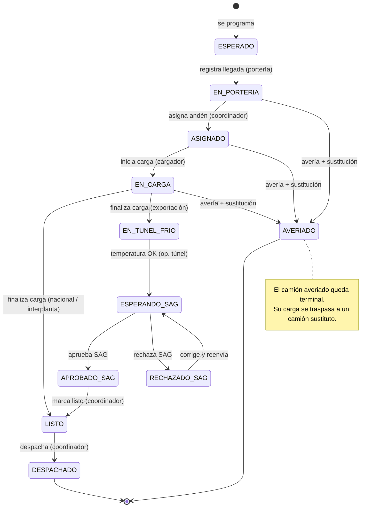
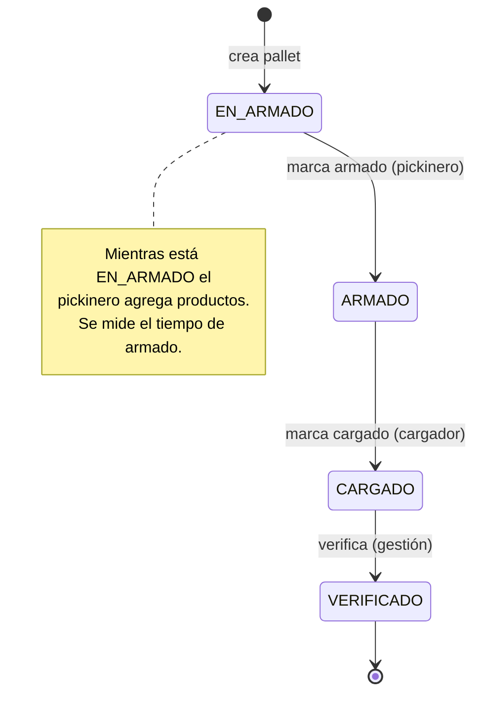
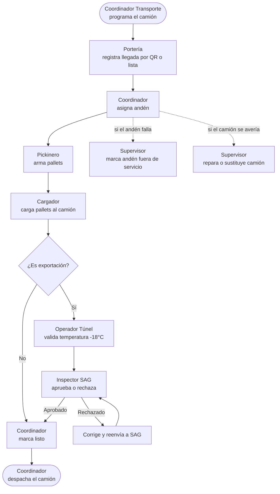

# Diagramas del sistema — DispatchTrack

Diagramas generados a partir del modelo de datos y la lógica reales del sistema (esquema Prisma y máquina de estados). Están escritos en **Mermaid**, por lo que se renderizan automáticamente en GitHub, en VS Code (con vista previa de Mermaid) y al exportar a PDF con extensiones que soporten Mermaid.

Contenido:
1. Modelo Entidad-Relación (MER) completo
2. MER simplificado (núcleo del flujo)
3. Máquina de estados del camión
4. Máquina de estados del pallet
5. Diagrama de flujo del proceso operativo

---

## 1. Modelo Entidad-Relación (MER) completo

---

## 2. MER simplificado (núcleo del flujo)

Versión reducida para ilustrar el corazón del modelo sin el detalle de auditoría y eventos.

---

## 3. Máquina de estados del camión

Transiciones válidas según el tipo de camión. Exportación incorpora túnel de frío e inspección SAG.

---

## 4. Máquina de estados del pallet

---

## 5. Diagrama de flujo del proceso operativo

Recorrido de un camión por los distintos roles y pantallas.

---

## Cómo visualizar / exportar estos diagramas

- **GitHub:** se renderizan solos al ver el archivo en el repositorio.
- **VS Code:** vista previa con `Ctrl+Shift+V` (instalá la extensión *Markdown Preview Mermaid Support* si no se ven).
- **PDF:** ver instrucciones en la sección de exportación del README del informe.
